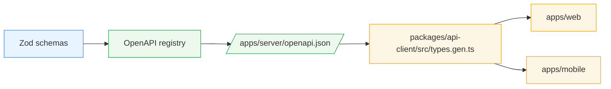

# `@autocare/shared/contracts`

Single source of truth for the Autocare HTTP API. Every request and response
shape is defined here as a [Zod](https://zod.dev) schema, and the server
converts these schemas into an OpenAPI 3.1 document that web and mobile
clients consume via generated TypeScript types.



## Folder layout

- `common.ts` — envelope (`successResponseSchema`, `ApiErrorResponseSchema`),
  shared primitives (`UuidSchema`, `PaginationQuerySchema`, `IntegrityHashSchema`).
- `vehicles.ts`, `ai.ts`, `reports.ts`, `analytics.ts`, `audit.ts`, `consent.ts`,
  `utility.ts`, `system.ts` — one file per server module.

Each domain file exports:

- `*BodySchema` — request body.
- `*ParamsSchema` — path params.
- `*QuerySchema` — query string.
- `*ResponseDataSchema` — the `data` payload that goes inside the
  `{ success: true, data }` envelope.

## Adding a new route (schema-first workflow)

1. **Write the schema** in the matching domain file under
   `packages/shared/src/contracts/<domain>.ts`. Keep the file pure — no
   `.openapi()` chains, no server imports.

   ```ts
   export const CreateFoobarBodySchema = z.object({
     name: z.string().min(1),
   })

   export const CreateFoobarResponseDataSchema = z.object({
     id: z.string().uuid(),
   })
   ```

2. **Register the route** on the server in the module's router using the
   OpenAPI registrar. The registrar wraps response data in the success
   envelope automatically and mounts a Zod validation middleware.

   ```ts
   registerRoute(router, '/api', {
     method: 'post',
     path: '/foobars',
     tags: ['Foobars'],
     summary: 'Create a foobar',
     operationId: 'createFoobar',
     body: CreateFoobarBodySchema,
     responses: {
       201: {
         description: 'Foobar created',
         dataSchema: CreateFoobarResponseDataSchema,
       },
     },
     handler: ({ body, res }) => {
       commonPresenter.created(res, { id: createId() })
     },
   })
   ```

3. **Regenerate the spec and client types**:

   ```bash
   npm run openapi:generate -w @autocare/server
   npm run generate:types -w @autocare/api-client
   ```

4. **Use it on the clients**. `paths` and `operations` from
   `@autocare/api-client` are now typed. Prefer adding a thin React hook in
   `packages/api-client/src/react/hooks.ts` if the endpoint is reused.

## Validation behaviour

`registerRoute` attaches middleware that runs each provided Zod schema
against `req.params`, `req.query`, and `req.body`. On failure it returns a
`400` with the shared `ApiErrorResponseSchema` shape:

```json
{
  "success": false,
  "error": {
    "code": "validation_error",
    "message": "Invalid request body",
    "details": [{ "path": ["name"], "message": "Required" }]
  }
}
```

The 400 response is registered against the OpenAPI operation automatically,
so every client sees the same failure shape.

## Governance

- **CI diff** (`.github/workflows/openapi-diff.yml`): Every PR runs
  `oasdiff` between `main` and the PR branch. Breaking changes fail the
  build unless the PR title contains `[breaking]` *and* the API version in
  `info.version` has been bumped.
- **Contract tests**
  (`apps/server/src/interfaces/http/openapi/__tests__/registry.contract.test.ts`):
  Asserts that every expected `operationId` is registered and mounted under
  `/api/...` or `/auth/...`. Missing or renamed operations fail the test suite.
- **Dev-time artifact**: `apps/server/openapi.json` is rewritten on every
  dev server boot and by `npm run openapi:generate -w @autocare/server`,
  enabling offline codegen for web/mobile.

## Ownership

Schema changes are reviewed by the module owner *and* the mobile/web leads
(the consumers). Never merge a breaking change to this folder without
updating `info.version` and flagging it with `[breaking]` in the PR title.
